## 计算机毕业设计吊打导师hadoop+spark+hive知识图谱音乐推荐系统 音乐数据分析可视化大屏 音乐爬虫 LSTM情感分析 大数据毕设 深度学习 机器学习 大数据 大数据毕业设计 机器学习 预测系统 数据仓库 大数据毕业设计 文本分类 LSTM情感分析 大数据毕业设计 知识图谱 大数据毕业设计 预测系统 实时计算 离线计算 数据仓库 人工智能 神经网络

## 要求
### 源码有偿！一套(论文 PPT 源码+sql脚本+教程)

### 
### 加好友前帮忙start一下，并备注github有偿hive旅游数仓+推荐
### 我的QQ号是2827724252或者798059319或者 1679232425或者微信:bysj2023nb

# 

### 加qq好友说明（被部分 网友整得心力交瘁）：
    1.加好友务必按照格式备注
    2.避免浪费各自的时间！
    3.当“客服”不容易，repo 主是体面人，不爆粗，性格好，文明人。

基础版，也就是当前下面连接这个版本(只带hadoop spark hive flask Python爬虫 echarts大屏可视化驾驶舱)

https://www.bilibili.com/video/BV1M94y1z7Px/?spm_id_from=333.999.0.0

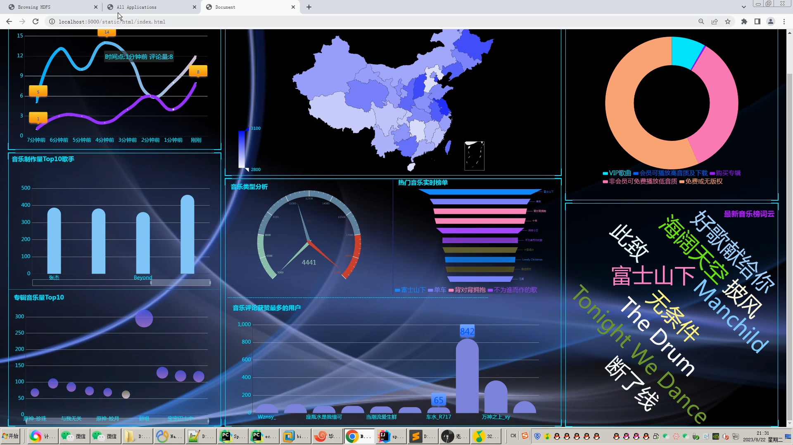
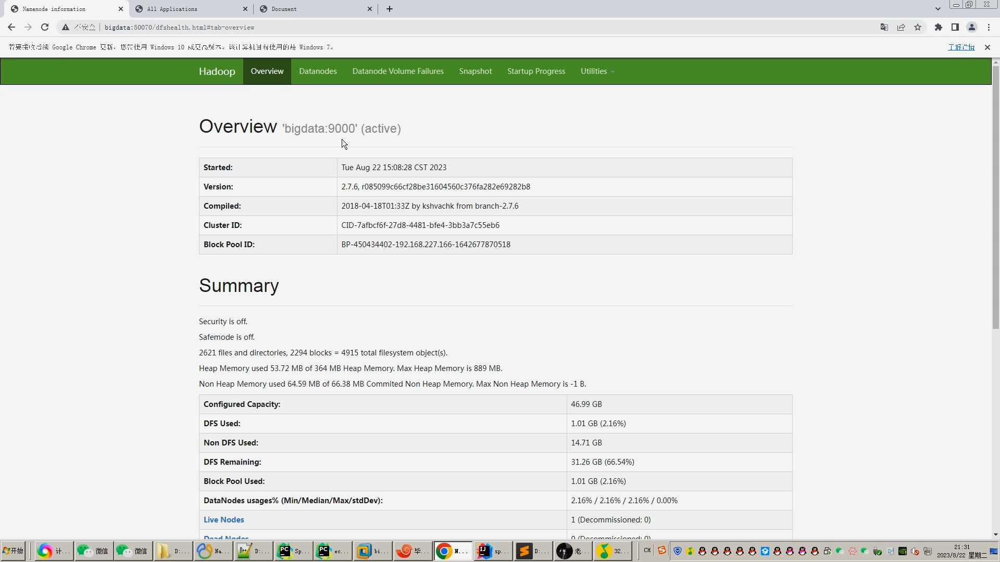
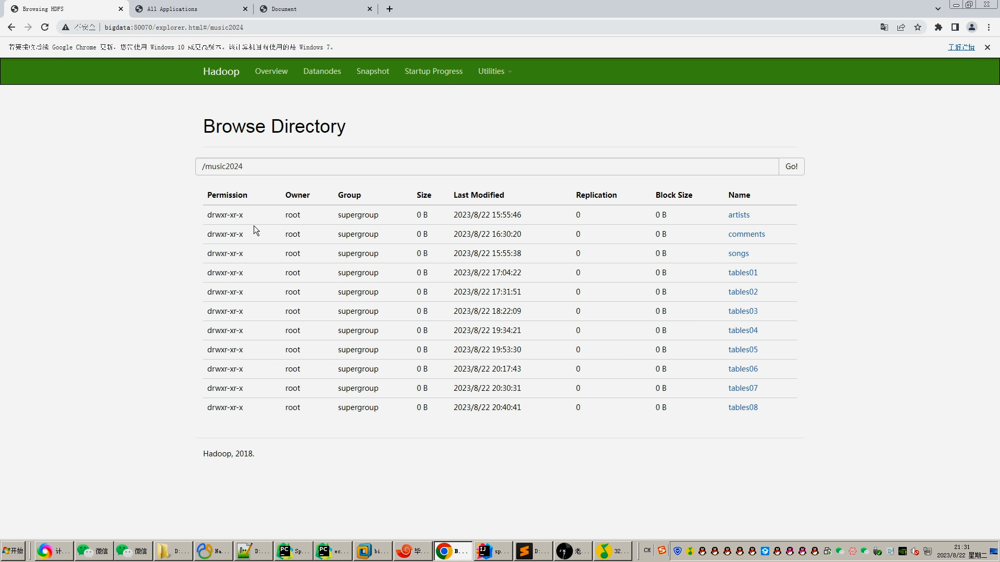
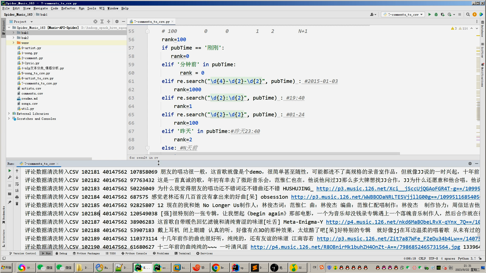
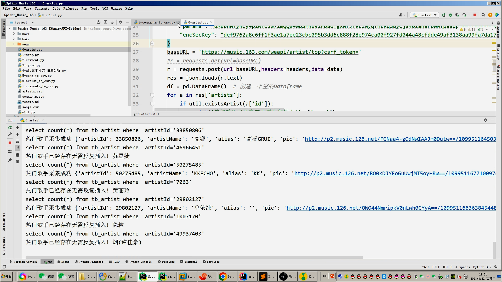
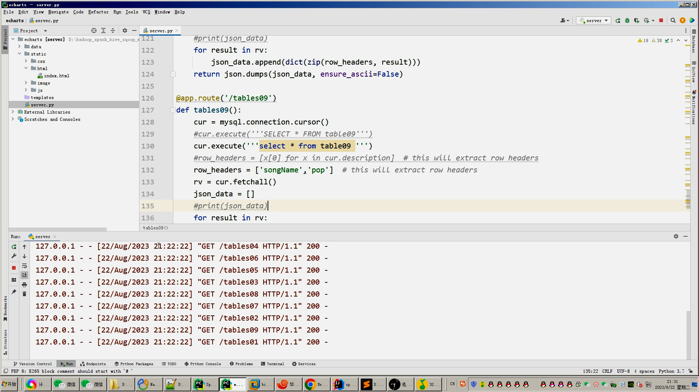
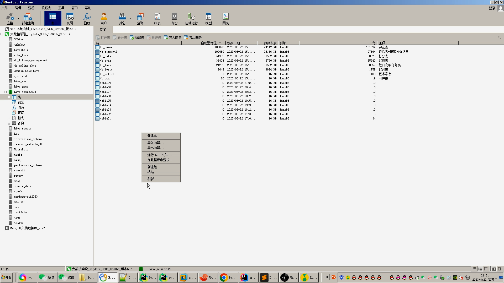
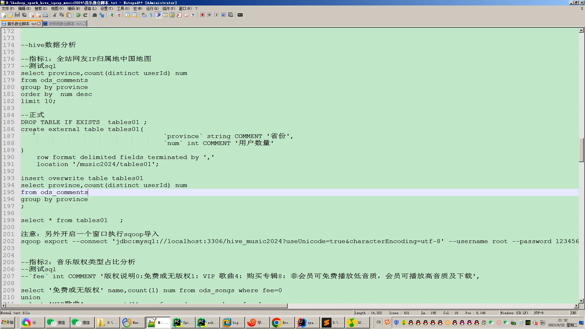
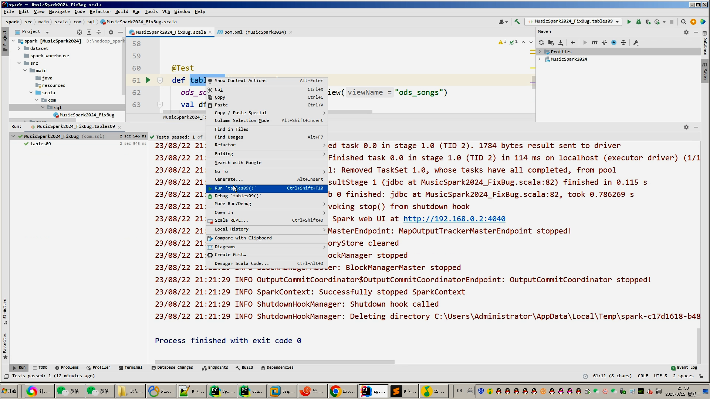
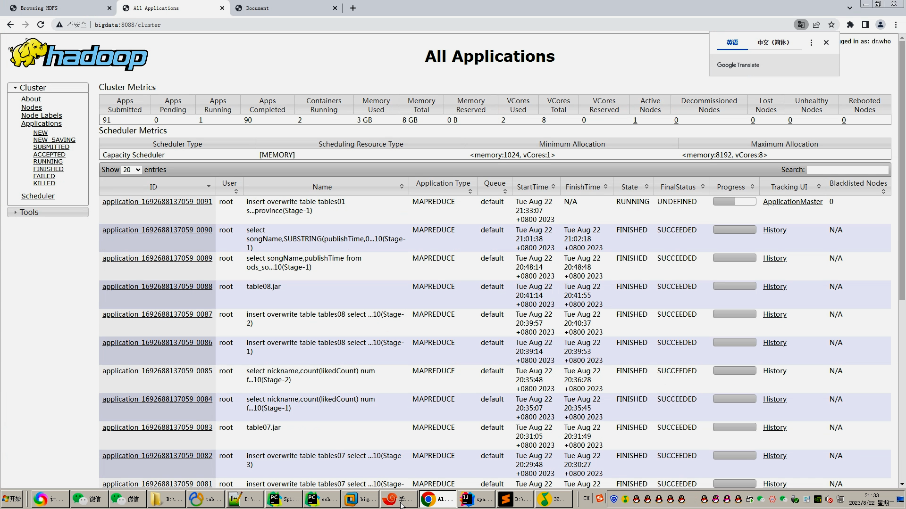
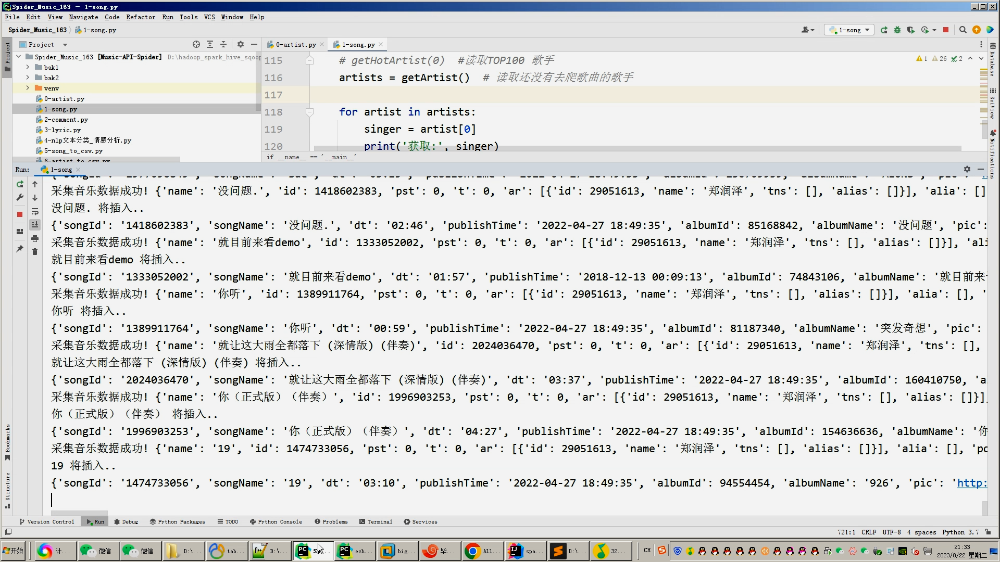
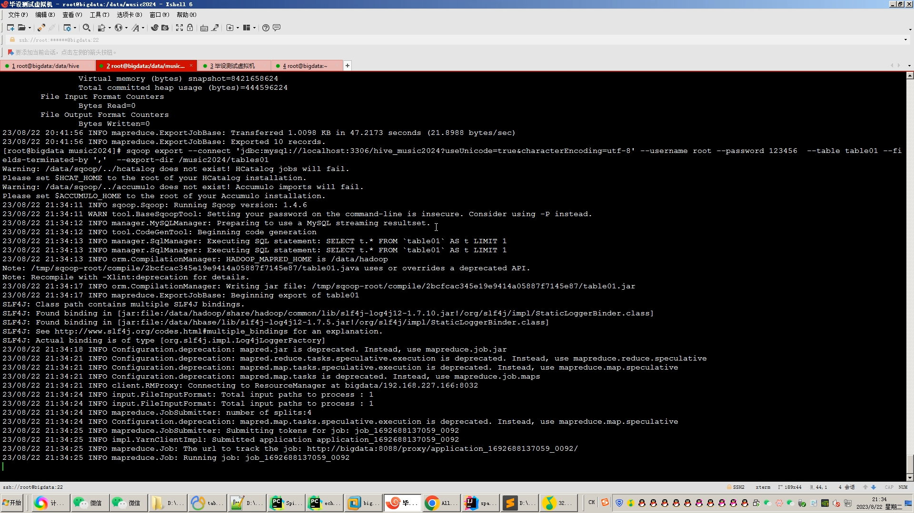

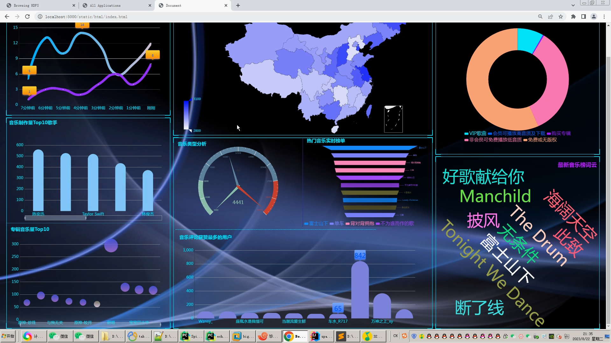
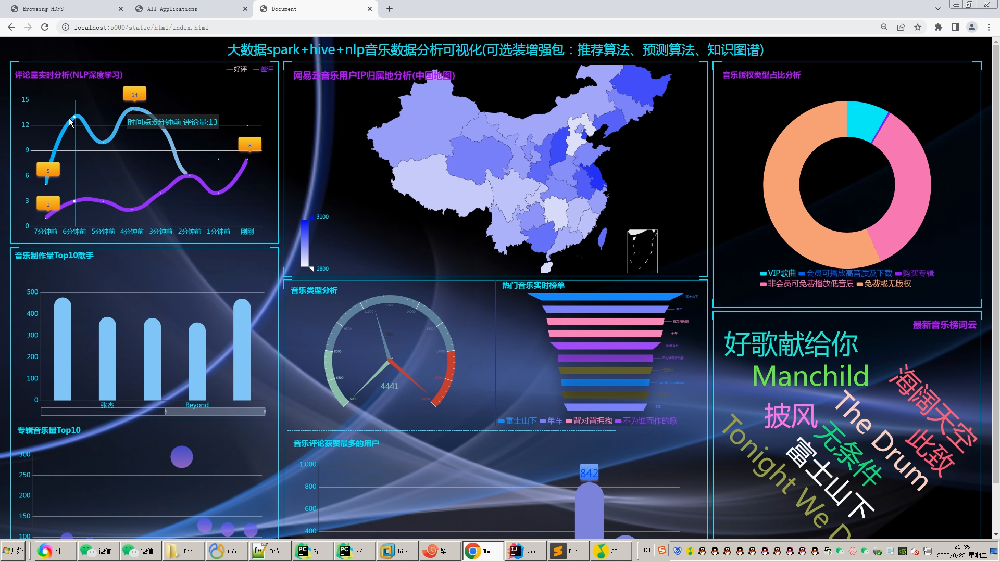
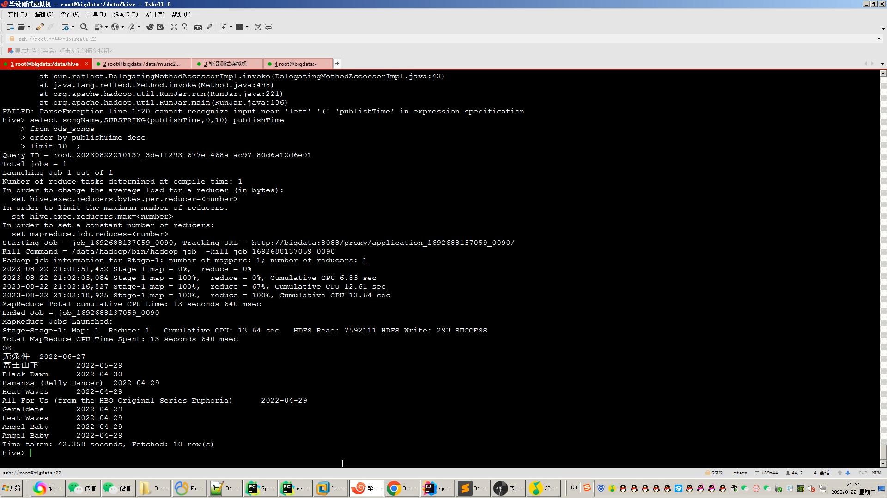

## 开发技术：
spark hadoop hive 装杯显摆虚拟机Linux敲命令炫酷吊打 flask echarts sqoop scala hdfs yarn mysql python爬虫框架等；

## 流程： 

1.Python采集网易云音乐歌手、歌词、音乐、评论等约10-20万+海量数据，存入mysql数据库；

2.使用pandas+numpy/MapReduce对mysql中四类数据进行数据清洗，写入.csv文件并上传至hdfs(含评论NLP文本分类/lsm情感分析);

3.使用hive建库建表，导入.csv数据集；

4.一半分析指标使用hive_sql完成，一半分析指标使用Spark之Scala语法完成；

5.将分析结果使用sqoop导入mysql数据库的指标表；

6.使用Flask+Echarts搭建可视化大屏界面；

## 创新点：
1.Python爬虫采集海量数据；

2.lstml情感分析/NLP文本分类；

3.spark实时分析+(hadoop、hive离线分析数据仓库)双实现，可实时可离线防止导师喷人,干死中国死全家杂种导师喷天喷地死他妈逼去吧；

4.可视化大屏炫酷显摆；

## 干死中国导师王八杂种玩意，天天炸片国家补贴，技术为0，吹牛逼第一靠狗一样的存在
##  他妈比做个毕设杂种导师喷天喷地司马绝种一样

## 可选装项目模块如下：
1.推荐系统(4种深度学习推荐算法 协同过滤基于用户 基于物品 SVD神经网络 MLP)。附带AI、支付、短信、lstm情感分析。
2.预测系统(KNN CNN RNN卷积神经预测 K-means 线性回归)。
3.知识图谱neo4j可视化关系网络图。
4.后台管理系统。

## 注意：如果还觉得本系统太简单太low工作量不够，可以选装推荐系统、知识图谱、预测系统、后台管理啊，可以无缝衔接0秒对接上！！！实现效果如下：

https://www.bilibili.com/video/BV1tV4y1q7RJ/?spm_id_from=333.999.0.0

https://www.bilibili.com/video/BV1PN4y1P7LX/?spm_id_from=333.999.0.0

https://www.bilibili.com/video/BV1234y1676e/?spm_id_from=333.999.0.0

